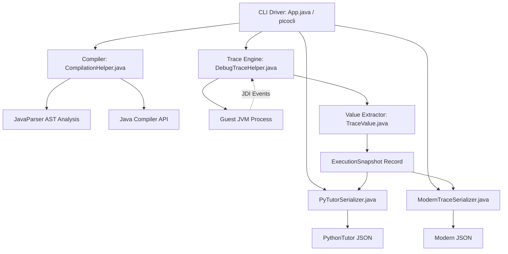
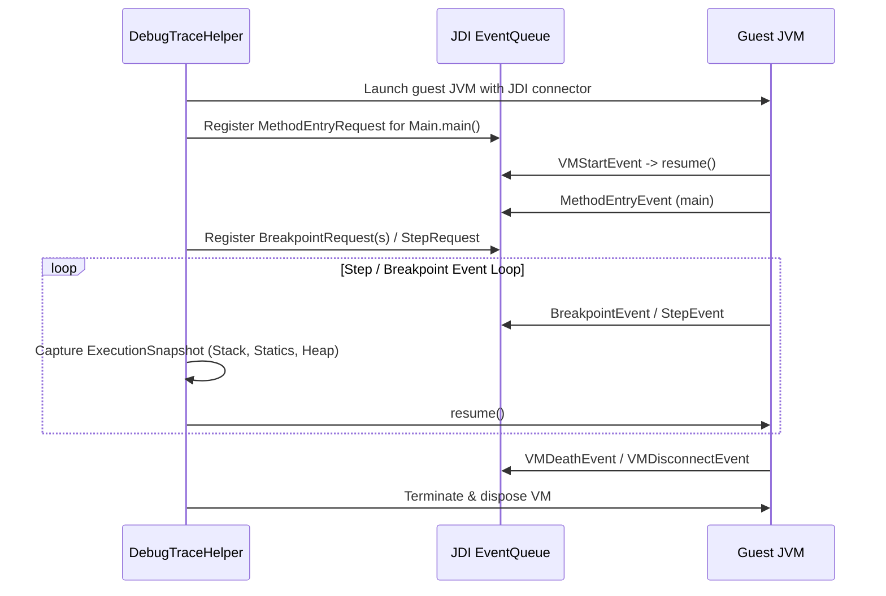

# Project Architecture & Developer Guide

`cs1302-tracer` is a programmatic Java execution tracer built on top of the Java Debug Interface (JDI) and JavaParser. It compiles arbitrary guest Java code (including multi-file packages and streamed sources), executes it inside a sandboxed guest JVM, inspects execution states at method/line breakpoints, traverses the reachable object graph on the heap, and serializes the execution trace into JSON.

---

## 1. System Decomposition

The project is structured into modular components:



### Package Organization

| Package | Purpose |
| :--- | :--- |
| `cs1302.tracer` | Entry point, CLI command definitions (`App.java`), and compilation pipeline (`CompilationHelper.java`). |
| `cs1302.tracer.trace` | JDI execution engine (`DebugTraceHelper`), snapshot representation (`ExecutionSnapshot`), and heap value extractor (`TraceValue`). |
| `cs1302.tracer.model` | Common trace metadata and shared models (`TraceFormat`, `BreakpointEntry`). |
| `cs1302.tracer.model.pytutor` | PythonTutor compatibility models (`PyTutorTrace`, `TraceStep`, `RenderStackFrame`). |
| `cs1302.tracer.model.modern` | Modern clean JSON models (`Trace`, `Step`, `StackFrame`, `Variable`, `HeapObject`, `Reference`). |
| `cs1302.tracer.serialize` | Serializers converting snapshots into JSON (`PyTutorSerializer`, `ModernTraceSerializer`). |

---

## 2. Core Subsystems

### A. CLI Driver (`App.java`)

Built using [Picocli](https://picocli.info/), `App.java` handles argument parsing, subcommand routing, and pipeline orchestration.

- **Commands**:
  - `trace`: Main execution command. Options:
    - `-b, --breakpoint`: Specific line numbers to take snapshots at.
    - `-a, --all-breakpoints`: Traces every executable line chronologically.
    - `-c, --accumulate-breakpoints`: Accumulates multiple hits on the same line into arrays.
    - `-f, --format`: Choose output format: `pytutor` (default) or `modern`.
    - `--no-main-args`: Strips the `args` array parameter from `main(String[])` frame locals.
    - `--inline-strings`: Displays string values directly in variable slots rather than pointing to heap objects.
    - `--no-method-this`: Omits the `this` reference from instance method stack frames.
  - `list-breakpoints`: Analyzes source files and lists valid line numbers where breakpoints can be set.
  - `show-licenses`: Dynamically reads and prints bundled third-party license notices (`META-INF/THIRD-PARTY.txt`).

---

### B. Compilation Engine (`CompilationHelper.java`)

`CompilationHelper` parses and compiles guest Java code into an isolated temporary directory before launching the tracer.

1. **Source Discovery & Parsing**:
   - Uses `com.github.javaparser` to inspect the Abstract Syntax Tree (AST).
   - Identifies package declarations, public classes/interfaces/enums/records, and locates the `main(String[] args)` method.
2. **Multi-File & Streaming Support**:
   - **File / Directory Inputs**: Resolves source roots based on package declarations (e.g. `cs1302/account/Driver.java` -> root directory).
   - **Standard Input Streaming**: Accepts multiple source files concatenated via standard input separated by comment headers:

     ```java
     // --- cs1302/math/Calculator.java ---
     package cs1302.math;
     public class Calculator { ... }

     // --- cs1302/math/Driver.java ---
     package cs1302.math;
     public class Driver { public static void main(String[] args) { ... } }
     ```

   - Automatically splits the stream, writes files into their corresponding package directory structure, and tracks file boundaries.
3. **Compilation**:
   - Compiles using `javax.tools.JavaCompiler` with debug flags (`-g`) enabled so full local variable tables and line number tables are emitted in `.class` files.
   - Wraps compiled classes in an autocloseable `CompilationResult` that cleans up temporary directories upon exit.

---

### C. Trace Engine (`DebugTraceHelper.java`)

`DebugTraceHelper` launches and debugs the guest JVM using the Java Debug Interface (`com.sun.jdi`).



- **Tracing Modes**:
  - **Single Snapshot (Default)**: Takes a single snapshot at the final executable statement of `main`.
  - **Selected Breakpoints (`-b`)**: Places breakpoints at specified lines and records snapshots when hit.
  - **Chronological Stepping (`-a`)**: Automatically steps through every line across all files in the execution path.
- **Multi-File Context**:
  - Tags each snapshot, stack frame, and breakpoint with its relative source file path (e.g., `cs1302/account/Account.java`).
- **VM Lifecycle & I/O Isolation**:
  - Captures `stdout` and `stderr` streams separately in real time.
  - Calls `vm.exit(0)` before disposing the connection to prevent hanging suspended guest threads.

---

### D. Value Extractor & Reachable Heap Traversal (`TraceValue.java`)

To capture heap state without depending on guest JVM memory addresses after execution ends, `TraceValue` inspects mirrored JDI values and converts them into host JVM objects:

1. **Primitive & Wrapper Values**: Extracted directly (e.g., `IntegerValue`, `BooleanValue`, `DoubleValue` handling `NaN` and infinities).
2. **String Values**: Captured as `TraceValue.String`.
3. **Object Graph Traversal (Mark-and-Sweep)**:
   - Starting from all static fields and active stack frame local variables, reachable objects are traversed recursively.
   - Circular references and pointer aliasing are tracked via `ObjectReference.uniqueID()`, ensuring shared objects reference the same heap entry.
4. **Specialized Heap Types**:
   - `ArrayReference` / `java.util.List` / `java.util.Collection` -> Array/List elements with reified runtime types.
   - `java.util.Map` -> Key-value pairs serialized as structured entries.
   - Lambdas & Method References -> Inspected via enclosing class and functional interface SAM name.
   - Boxed Primitives (`java.lang.Integer`, etc.) -> Extracted with underlying primitive payload.

---

### E. Serialization Subsystem (`cs1302.tracer.serialize`)

#### 1. PythonTutor Format (`PyTutorSerializer`)

Converts snapshots into the tuple/list JSON schema expected by Online Python Tutor:

- Heap objects encoded as tuple lists: `["INSTANCE", "ClassName", ["field", value], ...]` or `["LIST", elem1, elem2]`.
- Reified collection type labels in `heap_attrs` map.

#### 2. Modern Clean Format (`ModernTraceSerializer`)

Generates an explicit, developer-friendly JSON format:

- **Reference Semantics**: Pointer values are modeled explicitly as `{"ref": 42}`.
- **Heap Map**: Keyed by object ID (`"heap": { "42": { "kind": "object", "type": "Account", "fields": [...] } }`).
- **Flat Typed Variables**: `[{"name": "x", "type": "int", "value": 5, "final": false}]`.
- **Source File Metadata**: Steps and stack frames contain `"file": "cs1302/account/Driver.java"`.

---

## 3. Data Models (`cs1302.tracer.model`)

```text
cs1302.tracer.model
├── TraceFormat.java                     # Trace format enum (PYTUTOR, MODERN)
├── BreakpointEntry.java                 # Breakpoint line validity model
├── pytutor/                             # PythonTutor format models
│   ├── PyTutorTrace.java                # Root PythonTutor trace wrapper
│   ├── TraceStep.java                   # Individual PythonTutor execution step
│   └── RenderStackFrame.java            # Stack frame structure for PythonTutor
└── modern/                              # Modern format models
    ├── Trace.java                       # Root modern trace wrapper
    ├── Step.java                        # Individual modern execution step
    ├── StackFrame.java                  # Modern stack frame with thisObject ref
    ├── Variable.java                    # Typed variable representation
    ├── HeapObject.java                  # Heap object representation (object/array/string/box/lambda)
    └── Reference.java                   # Pointer reference object {"ref": id}
```

---

## 4. Development, Testing & Coverage

### Building the Project

```bash
# Compile and run unit tests with JaCoCo verification
mvn clean test

# Build fat JAR with all dependencies bundled
mvn package -DskipTests -Djacoco.skip=true
```

### JaCoCo Coverage Requirement

The build enforces **100% line coverage** and **100% branch coverage** across all production classes using `jacoco-maven-plugin`. Any untested branches or lines will cause the build to fail.

### Running Example Traces

The `examples/` directory contains 24 reference test cases (`example0` through `example23`) covering basic primitives, multi-file packages, loops, lambdas, instance methods, stdin streaming, pointer aliasing, varargs, unbuffered standard output, standard error capture, and uncaught runtime exceptions.

To regenerate all example outputs:

```bash
./examples/generate_all.sh
```

---

## 5. References & Further Reading

- [JDI - Java Debug Interface Specification](https://docs.oracle.com/en/java/javase/21/docs/specs/jdi/index.html)
- [JavaParser Documentation](https://javaparser.org/)
- [Picocli User Manual](https://picocli.info/)
- [Online Python Tutor Trace Format](https://github.com/pgbovine/OnlinePythonTutor/blob/master/v3/docs/opt-trace-format.md)
